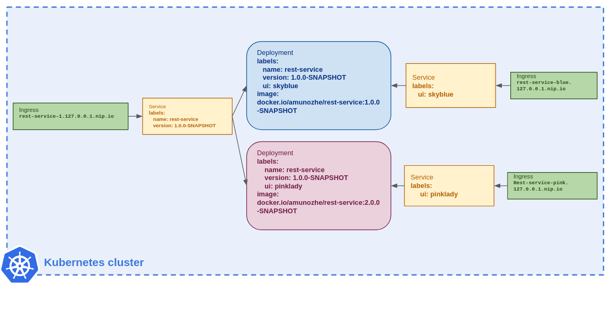

# configurable-rest-service
An example back-end service used in [Quarkus Insights #70](https://www.youtube.com/watch?v=l3mLKU3wR2A).


## Running locally
To start the service, build it and run the created jar:
```shell
./mvnw clean package
java -jar target/quarkus-app/quarkus-run.jar
```

## Deploying to Kubernetes
###Build and push the docker images
Before deploy the Kubernetes resources to the cluster, let's package the microservice into a container image runnable by Kubernetes and push it to Docker.io.
This is also done by a Quarkus extension:

```shell
 <dependency>
      <groupId>io.quarkus</groupId>
      <artifactId>quarkus-container-image-docker</artifactId>
 </dependency>
```
The following properties configure the pushing of the container image in order to make it accessible by the cluster:
```properties
quarkus.container-image.push=true
quarkus.container-image.registry=docker.io
```
Make sure you’re logged in to the Docker.io registry

As already mentioned we will have two instances os the service, we need then two container images:
- the bluesky container image can be built by running:
```shell
./mvnw clean package
```

### Apply manifests to the 
The Kubernetes descriptor has been generated by the Quarkus Kubernetes extension during the build. It should be in the `target/kubernetes` folder.
The [Quarkus Kubernetes extension](http://quarkus.io/guides/deploying-to-kubernetes) is used in order to generate the Kubernetes resources.
Two instances of the service will be deployed, one blue and one pink. They can be accessed with a browser pointing to `rest-service-blue.127.0.0.1.nip.io` and `rest-service-pink.127.0.0.1.nip.io` respectively.

- To create the blue instance of the rest-service in the `stork-demo` namespace:
```shell
kubectl create ns stork-demo
kubectl apply -f target/kubernetes/kubernetes.yml -n stork-demo
```

- the pinklady container image is built by running the build command above, but we will modify the Docker file adding `-Dcolor=#e0c0e0` to the `JAVA_OPTIONS` in order to change background color. Then, modify the version to `2.0.0-SNAPSHOT` in the pom file. After this changes you need to build and push the new image by running the `./mvnw clean package` command again.

If everything went well you should see both images in your [Docker repositories](https://hub.docker.com/repositories) 

- Now, create the pink instance of the rest-service in the `stork-demo` namespace applying the corresponding manifest:
```shell
kubectl apply -f infra-k8s/deployment-v2.yaml -n stork-demo
```
- Create access to both instances of rest-service
In order to be able to show both UIs from a browser, we need to access the pods directly, we will do it using 2 specifics `ingress & services` pairs.

```shell
kubectl apply -f infra-k8s/route-2-rest-service-blue.yaml -n stork-demo
kubectl apply -f infra-k8s/route-2-rest-service-pink.yaml -n stork-demo
```

The image bellow shows all the Kubernetes resources created:



